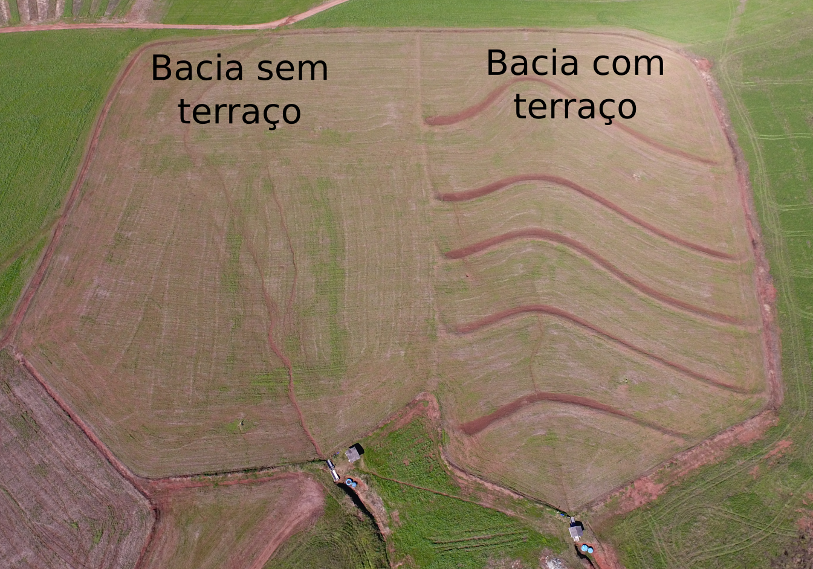
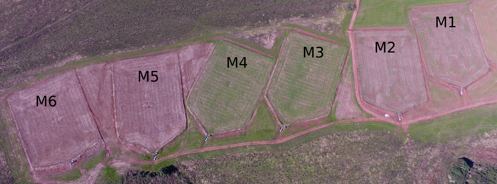
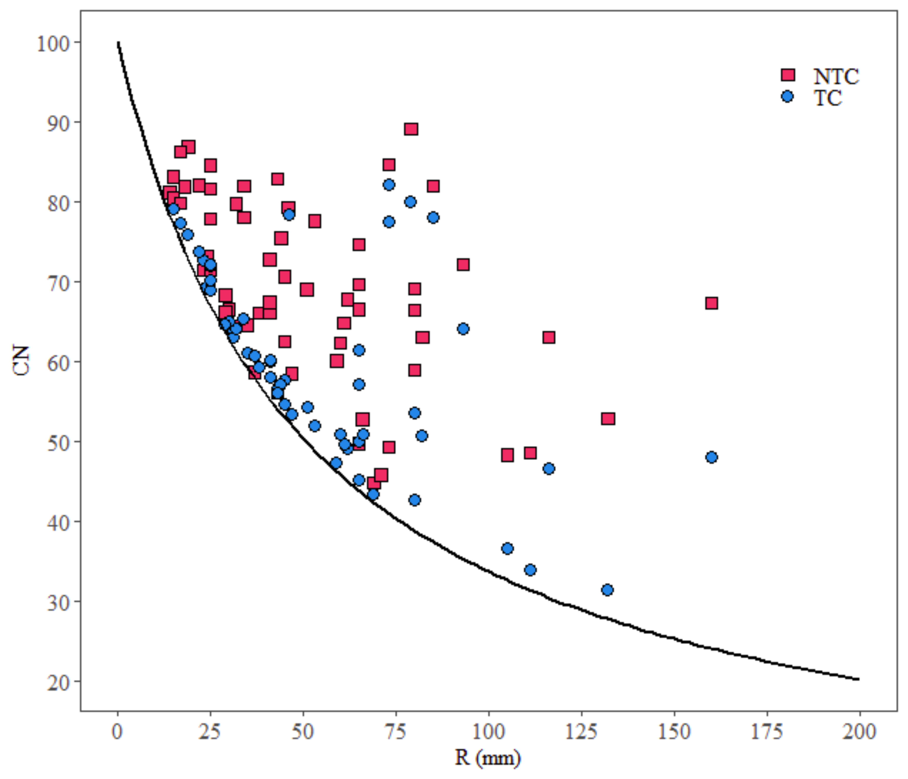
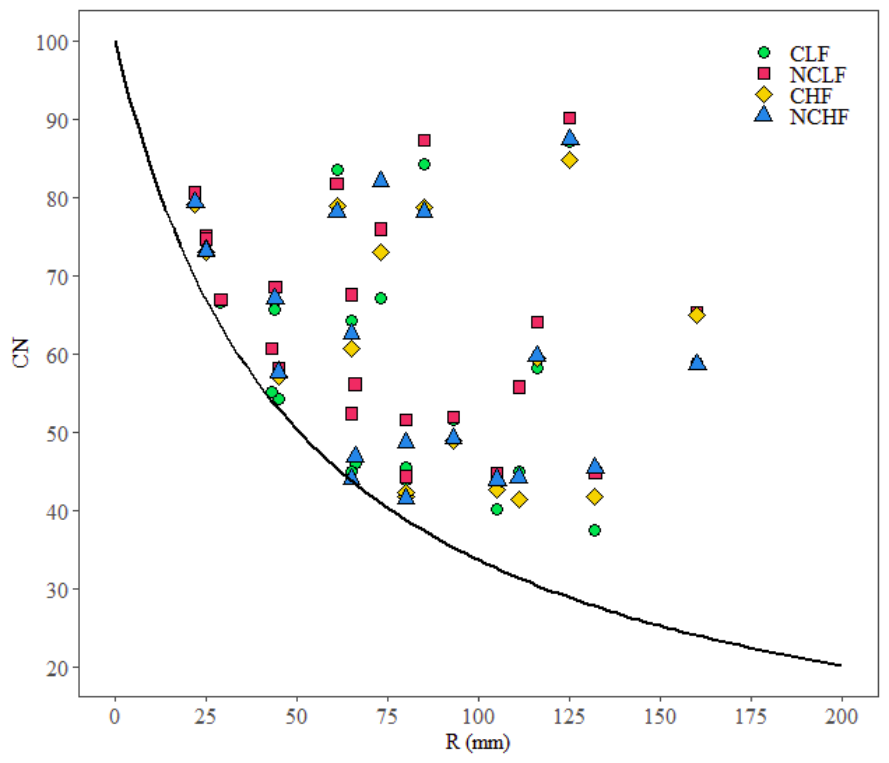
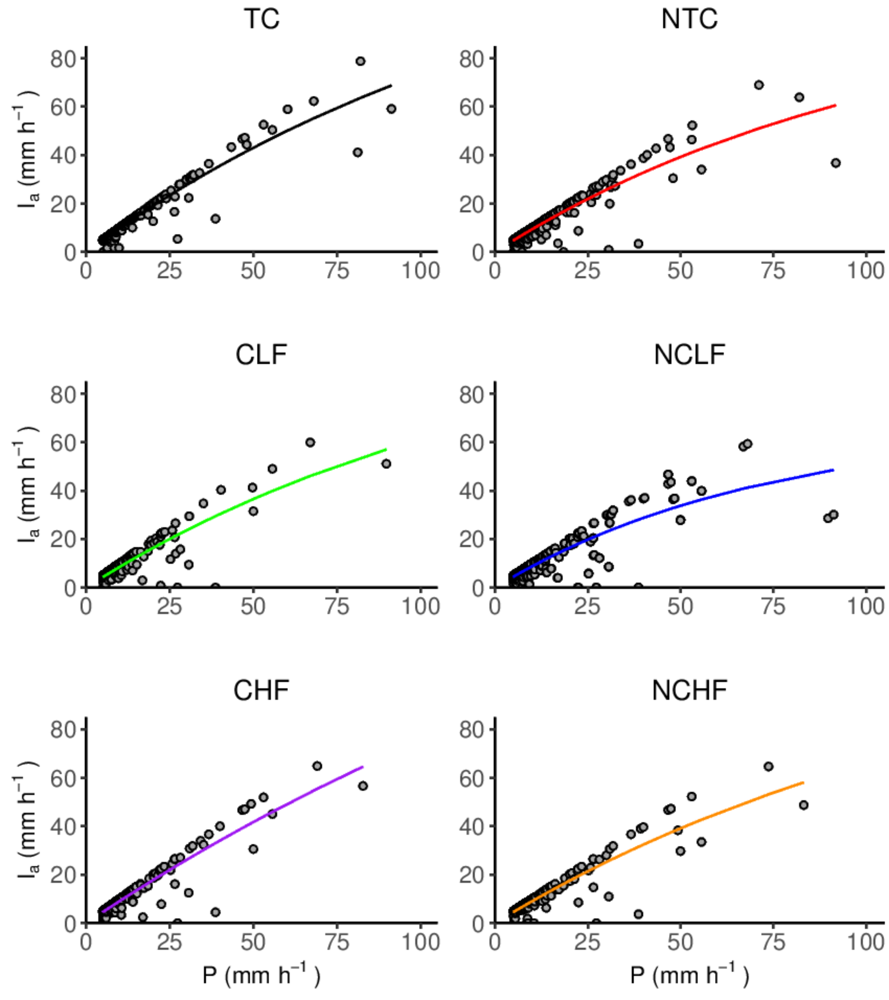
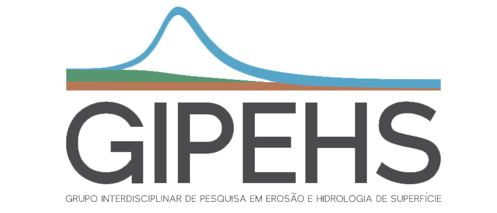

```{r setup, include=FALSE}
options(htmltools.dir.version = FALSE)
knitr::opts_chunk$set(fig.align = "center",
                      message = FALSE,
                      warning = FALSE,
                      echo = FALSE
                      )
```

```{r xaringan-themer, include=FALSE, warning=FALSE}
library(xaringanthemer)
style_mono_accent(
  base_color = "#23395b",
  header_font_google = google_font("Josefin Sans"),
  text_font_google   = google_font("Montserrat", "300", "300i"),
  code_font_google   = google_font("Fira Mono")
)
```


```{r xaringanExtra, echo=FALSE}
#devtools::install_github("gadenbuie/xaringanExtra")
xaringanExtra::use_xaringan_extra(c("tile_view", "animate_css", "tachyons"))
xaringanExtra::use_editable(expires = 1)
xaringanExtra::use_extra_styles(
  hover_code_line = TRUE,         #<<
  mute_unhighlighted_code = FALSE  #<<
)
```

.center[
# Grupo GIPEHS
]

```{r, out.width='90%'}
knitr::include_graphics("img/equipe.png")
```


---
# Estudos desenvolvidos em Júlio de Castilhos


- ### Contextualização da área de estudo;

--

- ### Trabalhos publicados/ em andamento;

--

- ### Dificuldades encontradas;


---
## Por quê essa escala?

- Pouca informação na escala de encosta!

--

```{r}
knitr::include_graphics("img/escala.png")
```


---
## Contextualização da área de estudo

```{r, out.width='80%'}

```

---
## Contextualização da área de estudo

```{r}

```

- M1: Escarificada, baixa fitomassa;
- M2: Não escarificada, baixa fitomassa;
- M3: Escarificada, alta fitomassa;
- M4: Não escarificada, alta fitomassa;
- M5: Escarificada, média fitomassa;
- M6: Não escarificada, média fitomassa;

---
# Estudos desenvolvidos em Júlio de Castilhos

- Monitoramento da chuva, vazão e sedimentos:

```{r, out.width='90%'}
knitr::include_graphics("img/monitoramento.png")
```


---
# Estudos desenvolvidos em Júlio de Castilhos

- Cota e amostra.

```{r}
knitr::include_graphics("img/q_ssc.png")
```

---
# Trabalhos publicados e em andamento

- ### 2 teses;
--

- ### 7 dissertações + 1 em andamento;
--

- ### 8 artigos publicados + 4 em andamento;
  - #### CN;
  - #### Ia;


---
# Derivação da curva número

.pull-left[
- Bacias de ordem zero:

```{r}

```
]


.pull-right[
- Macroparcelas:

```{r}

```
]

---
# Infiltração aparente

```{r, out.width="50%"}

```

---
# Dificuldades encontradas

.pull-left[

- ### Recursos;

- ### Roubo/ vandalismo;

- ### Distância;
]

.pull-right[

```{r}
knitr::include_graphics("img/rota.png")
```
]

---
class: center

# Obrigado pelo atenção!

email: fjas.schneider@gmail.com

```{r}

```


